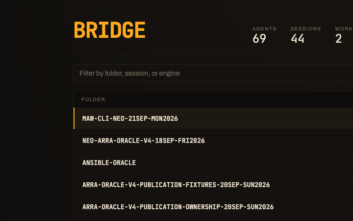

# Bridge

[](https://bridge.buildwithoracle.com)
[](https://github.com/Soul-Brews-Studio/maw-ui-template/generate)

A departure board for a fleet of agents. It reads `maw herdr serve` and shows
every pane as a row that flips when its status changes — with a live miniature
of that pane's terminal on the left of every row.



```
bridge.buildwithoracle.com/?host=http://127.0.0.1:3457
```

## Pointing it at a fleet

`?host=` is read once, remembered, and stripped from the address bar, so a
reload is not a re-configuration. Press <kbd>h</kbd> to change it later, or
leave it unset to read whatever origin served the page.

Reads need nothing. `wake` and `send` need the operator token, which you paste
with <kbd>t</kbd> and which never leaves your browser.

```bash
# read-only, self-expiring, no token
maw herdr serve --insecure-no-token --listen 127.0.0.1:3488 --demo-minutes 30

# full operator access
maw herdr serve --token-file ~/.maw-herdr-token --listen 127.0.0.1:3457
```

## The pane cell

Every row carries a square miniature of the real terminal, streaming. It is laid
out at true terminal width and then scaled down, so the words are not readable
and are not meant to be: what carries is the *shape* of the output, which is how
you tell a pane that is building from one that is waiting.

Click it, or press <kbd>⏎</kbd> on the row, for the full pane at full size, still
streaming, with a line to type back into it.

## Streaming

The board holds one WebSocket to the backend, the same one god uses. The roster
arrives on connect, every visible row gets a live 15-line preview, and whichever
pane is open streams 80 lines. If the socket cannot open — an old backend, a
closed demo window — it falls back to polling and says `polling` in the header
rather than pretending.

With an operator token it authenticates with a single-use ticket. Without one it
opens the socket unauthenticated, which a tokenless demo server accepts read-only.

## Keys

| Key | Does |
|---|---|
| <kbd>/</kbd> | Filter by folder, session, or engine |
| <kbd>j</kbd> <kbd>k</kbd> | Move the cursor |
| <kbd>g</kbd> <kbd>G</kbd> | First and last row |
| <kbd>⏎</kbd> | Open the full terminal |
| <kbd>w</kbd> | Wake the selected agent |
| <kbd>s</kbd> | Send it a message |
| <kbd>h</kbd> <kbd>t</kbd> | Backend, token |
| <kbd>?</kbd> | Key map |

## Why it is not god

[god.buildwithoracle.com](https://god.buildwithoracle.com) is a place you
explore: isometric rooms, a dozen views, an agent you find by knowing which tab
it lives in. Bridge is an instrument you read. One screen, no tabs, every agent
on it, sorted so blocked comes first.

It shares god's API contract exactly, including `?host=`, so both can watch the
same fleet at the same time.

Folder leads every row because it is the only part an operator recognises:
herdr encodes session names, so the raw id is base64url and identifies nothing
to a human. The id is still there, in the pane header, where you need it to
address the agent.

## Develop

```bash
bun install
bun run dev
bun run build
bun run deploy   # Cloudflare Workers, static assets only
```

It deploys as static assets only, with no Worker script: Cloudflare serves
files directly, so there is nothing that could see fleet data or hold a token.
Headers come from `public/_headers`, and SPA deep links from
`not_found_handling`.
